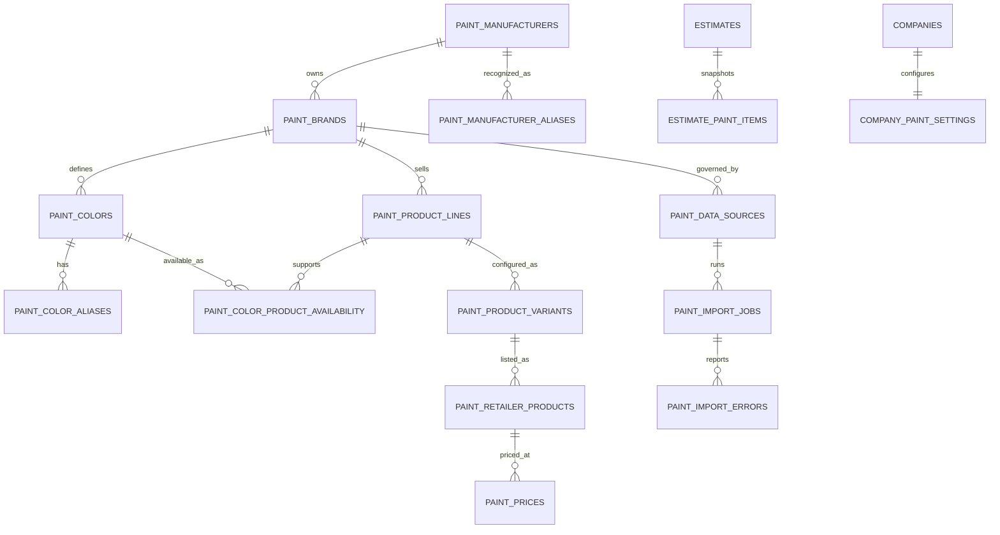

# SmartCoat paint catalog architecture

## Purpose and boundaries

The catalog separates manufacturer identity, consumer brand, color identity, product
line, sellable variant, sheen, container, availability, retailer listing, and price.
An estimate references catalog rows when available but always stores human-readable
snapshots, calculation inputs, pricing provenance, and override reasons. Later catalog
changes therefore cannot rewrite a historical estimate.

No color, product, coverage, availability, or price is seeded without an authorized
source. The initial migration seeds only canonical brands, aliases, controlled
lookups, retailers, and disabled source-discovery records.

## Search behavior

`public.search_paint_catalog` normalizes case, whitespace, Unicode dashes, and an
optional leading `#`, while preserving meaningful internal punctuation. Exact
primary code ranks first, followed by exact alias, code prefix, and color-name
matches. Brand filters resolve ambiguity; the UI never silently selects between
brands. Discontinued matches remain searchable and carry a warning.

Search is authenticated and read-only. Global catalog tables have RLS-enabled read
policies for signed-in users. Catalog mutation is not granted to browser roles.
Company settings and estimate snapshots use existing tenant membership, premium
entitlement, and role checks. Platform administration uses a dedicated allowlist,
not user-editable metadata.

## Estimate integration

The centralized estimate engine continues to own takeoff and price calculations.
The selected catalog identity and all effective calculation values are stored in
both the estimate JSON calculation snapshot and `estimate_paint_items`. A manual
coverage value requires a reason. Retailer configuration prices remain explicitly
identified as estimates rather than live or local quotes.

## Import flow

1. Register a source with authorization evidence and license reference.
2. Keep it disabled until its status is authorized.
3. Store the original approved artifact in private object storage.
4. Parse to the canonical staging shape and validate every row.
5. Reject duplicates, unsupported brands, invalid LRV/RGB/HEX, impossible coverage,
   and incomplete identifiers.
6. Review import counts and errors.
7. Upsert stable external identifiers in one transaction.
8. Append changes to the catalog change log; never overwrite price history.
9. Mark unseen records inactive only when the source contract supports full snapshots.
10. Record a successful sync only after post-import checks pass.

The migration database constraint prevents enabling `pending_permission` or
`unavailable` sources.

